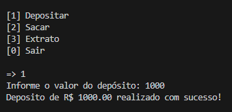
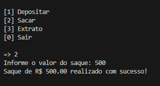
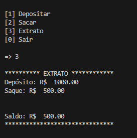
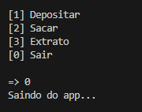

# Controle Financeiro em Python

📄 Este programa em Python oferece funcionalidades básicas para controle financeiro, com as seguintes opções:

- **[1] Depositar:** Permite fazer depósitos na conta, atualizando o saldo e registrando a transação no extrato.

- **[2] Sacar:** Permite fazer saques, desde que o valor não exceda o saldo, o limite de saque ou o número máximo de saques diários. Atualiza o saldo e registra a transação.

- **[3] Extrato:** Exibe um resumo das transações (depósitos e saques) e o saldo atual.

- **[0] Sair:** Encerra o aplicativo.

Variáveis importantes:

- `dinheiro`: Saldo disponível na conta.
- `limite`: Limite máximo de saldo permitido.
- `extrato`: Registro das transações.
- `numeroSaques`: Contagem de saques realizados.
- `limiteSaques`: Limite máximo de saques diários.

Este é um exemplo simples para fins educacionais. Sistema Bancario Simples criado como parte do desafio de aprendizado do curso DIO "Criando um Sistema Bancário com Python"
